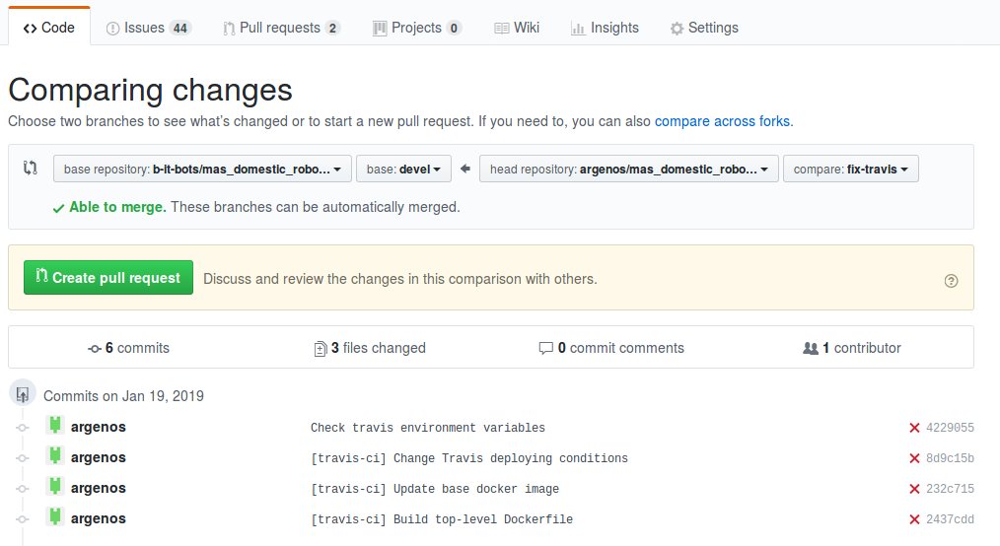

# Adding your first contribution

## Getting a task

During our meetings, we will usually discuss what are the important things on the team's to-do list. Once you have completed the first steps and tutorials, we will assign an [issue](https://github.com/b-it-bots/mas_domestic_robotics/issues) to you. You can also browse that list and find something that looks interesting for you.


You can find good issues for new members by filtering the [label 'good first issue'](https://github.com/b-it-bots/mas_domestic_robotics/issues?q=is%3Aopen+is%3Aissue+label%3A%22good+first+issue%22).


## Create a branch 

Before you start working, you should create a branch where you will save your changes. 


See [why should I avoid making commits in my kinetic or devel branch?](../_faq/git.md#why-should-i-avoid-making-commits-to-the-kinetic-or-devel-branch)


Our repositories usually have the following branches:

* `kinetic` - the stable branch which contains code which _rarely_ fails and has been thoroughly tested.
* `devel` - the development branch where you will find the _latest_ version of our code, including bug fixes, new features and experimental code.

As a developer, you will usually always start your work based on the `devel` branch. Depending on what you are working on, try to follow our branch naming conventions:

* `feature/name-of-feature`: New functionality that will be added to the robot.  Make the `name-of-feature` part as descriptive as possible.
* `fix/issue-NNN`: Fixing a bug that was found in existing code. If there is no issue for the bug you are trying to fix, just use a descriptive title.

To create a new branch which is based on `devel`, you can run the following command:

```text
git checkout -b <new branch> devel
```

For example:

```text
git checkout -b feature/my-very-descriptive-feature devel
```

For more information please look into the [branching model guide](../_conventions/git/branching-model.md).

## Making modifications

Start working on your new task. From time to time, commit your work \(and try to [make good commits](../_conventions/git/#how-to-write-good-commits)\).

Once you have made some progress, [create a pull request](https://help.github.com/en/articles/creating-a-pull-request) \(often abbreviated PR\) from your fork to `b-it-bots/mas_domestic_robotics`'s `devel` branch:




Once you press the create pull request, a form will appear. Try to follow the guidelines below:

* Make the title of your PR descriptive. If it's not ready to be merged yet, it's convention to add **WIP:** at the beginning of the title.
* Add a \(small\) text describing what your changes are doing
* Apply any labels that apply
* Request a review from the senior members \(GitHub will add some of them automatically, and will suggest some others\). 

